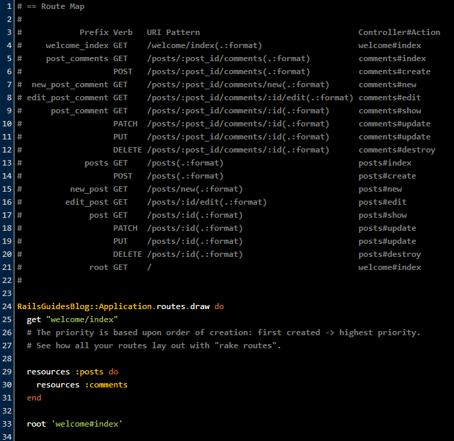

## Rails Study Group Week 4 Transcript


- [The Odin Project](http://www.theodinproject.com)

- [Study Group page on Odin](http://www.theodinproject.com/studygroup)

- [Week 4 Hangout Video]()

---

Three is the magic number, but 4 gives you more!  **Welcome to Week 4!**

- Last week we looked at [unit-testing methodology](https://github.com/afshinator/OdinRailsStudyGroup/blob/master/week3-transcript.md#an-approach-to-unit-tests);  this week we'll continue to go over testing related material, cover the assignment and the reading, go over some more gems, and more.   First, lets start off with some yummy knick-knacks.


### Knick-Knacks


#### Naming Conventions for classnames and filenames

**In code :**

- **Model** class name : capitalized, singular

  ```class Visitor < ActiveRecord::Base```

- **Controller** : pluralized model name with “Controller” in CamelCase

  ```class VisitorsController < ApplicationController```

**Filenames :**

- **Always lower, snake_case**, 

- Model filename matches models class name, but lowercase:  ```app/models/visitor.rb```

- Controller matches class name, but snake_case : ```app/controllers/visitors_controller.rb```

  ( Rails generate command lets you use either camel or snake case to generate snake_case filename )

  ```rails generate StaticPages home about``` - *(3.1)*

- Views folder matches model class name, but plural and lowercase : ```app/views/visitors```


###### *ref: [ Kehoe](http://learn-rails.com/)*


#### Instance Variables in your Controller & View

In a Rails controller, you'll often see a model assigned to an instance variable...

``` ruby
# from app/controllers/posts_controller.rb of the RailsGuides' tutorial
def index
  @posts = Post.all
end
```

Normal variables are available just in the method they are defined.  Instance variables are available anywhere inside the class. For example, ```@posts``` above is accessible anywhere in the Controller object, and ...

*Rails convention:* They are available not only to the controller, but also to your view!

*Why* is an instance variable available inside a view?

- Rails view is not a separate class; it's a template and part of the current controller object.

- 4 minute [Lynda video](https://www.youtube.com/watch?v=NEvWizHVy2I) on this topic.


Things that make you go "hmmm",


### Article: treehouse's [An Intro to RSpec ](http://blog.teamtreehouse.com/an-introduction-to-rspec)

- This article presented common RSpec idioms.   You're definitely going to see this material in Hartl as we go deeper; if you haven't read the article, go read it!  Watch out, they use the ```should``` syntax.

- Some highlights:

  ```before``` and ```after``` blocks

  ```describe``` and ```context```

  using ```let```, ```subject```, and [```specify```](http://stackoverflow.com/questions/8484133/difference-between-an-it-block-and-a-specify-block-in-rspec)


### Odin's [A Raily Web Refresher](http://www.theodinproject.com/ruby-on-rails/a-railsy-web-refresher)

- **Sniff you some HTTP** :  look at [http://web-sniffer.net/](http://web-sniffer.net/)

  - Check for ```theodinproject.com``` 

  - Do you know why we get a **301 Moved Permanently** ?


### Odin's [RestClient Project](http://www.theodinproject.com/ruby-on-rails/let-s-get-building)

  - I call mine [RestPinger](https://github.com/afshinator/playground/tree/master/RestPinger)

  - Not the cleanest code!  Passing in a load of params in the hash is an anti-pattern!   
  I took a crack at TDDing it, here are [tests](https://github.com/afshinator/playground/blob/master/RestPinger/restpinger_spec.rb),
  lets take a quick look...

  Note: How do I check the STDOUT output?, I hardcoded my Rails test app address

  - let's play with it...  Here is the rake:routes output that annotate_gem model puts in routes.rb:

  Try:

``` ruby
#  GET /post/:id  (#show)      
rp = RestPinger.new({ :rails => true, :host => "http://blackwater-bay-rails-75387.usw1.nitrousbox.com/", :prefix => "posts", :id => "3"} )  
```

  Voila!  We just mimicked a browser asking for a post from the blog.

  Let's get mischevious, try:

``` ruby 
#  GET /post/new  (#new)         This is destructive; we're asking for database changes now!
rp = RestPinger.new({ :rails => true, :host => "http://blackwater-bay-rails-75387.usw1.nitrousbox.com/", :prefix => "posts/new"} )
```

  **401 Unauthorized**: HTTP Basic: Access denied....   Let's check it out in the browser:

  Oh yeah, the RailGuides app used some authentication stuff in the posts controller...

``` ruby
class PostsController < ApplicationController
  
  http_basic_authenticate_with name: "afshin", password: "afshin", except: [:index, :show]  
```

  Lets take it out!  Try RestPinger with the above options again... we get the form back.

  Now lets get really evil.  **Let's destroy an article!**  What should our url look like?  Now we need a DELETE not a GET, the id of the post, and ... thats it.

``` ruby 
#  DELETE /post/:id  (#destroy)         This is destructive!
rp = RestPinger.new({ :rails => true, :verb => 'DELETE', :host => "http://blackwater-bay-rails-75387.usw1.nitrousbox.com/", :prefix => "posts",  :id => "2"} )
```  

  **422 Unprocessable Entity**!   422 is returned by the Rails ActionController by default when a POST doesn't contain a key, used to prevent **CSRF** - Cross-Site Request Forgery attacks. 

  To find out more about how you can get by this feature and hack your way into the heart of a Rails app, check out [WTF is 422?](http://blog.ethanvizitei.com/2008/04/wtf-is-422.html)!

  BTW, this project was a scaled down version of Websniffer, above.





### Hartl's Tutorial - [Chapter 3](http://ruby.railstutorial.org/chapters/static-pages#top) Misc points of interest

- Chock full of good stuff.   We're just at the beginning of the tutorial but there's a bunch of good stuff here.  Some of this stuff may not seem to be interesting or relevant but I think it'll definitely come up at some point in your Rails endeavours.

- *(Listing 3.1)* **The Gemfile** - Notice he locks down the version numbers so as to avoid incompatibilities between newest versions.

  + I'm going with **Rails 4.0.2** and **Ruby 2.0.0** as per current Nitrous.io defaults;  and Hartl's versions for RSpec, sqlite3, pg, rails_12factor (test & production groups); let's see if I encounter any problems along the way...

  + What is **rails_12factor**? A gem for static assets, required for Heroku deployment


- *Advice:* Look into **RVM** if you want to have multiple vers of Ruby on your box and be able to switch between them painlessly.


- The first time, he **bundle installs** like so: ```bundle install --without production``` to not install production gems.  After 1st time, it remembers that option for future ```bundles install``` invocations.


- **Security issue:** "Because the sample application is shared as a public repository [on Github], it’s important to update the so-called secret token used by Rails to protect session variables so that it is dynamically generated rather than hard-coded"

  + Modify ```config/initializers/secret_token.rb``` as per *listing 3.2*


+ Don't forget to update your ```.gitignore``` to something like *[listing 1.7](http://ruby.railstutorial.org/chapters/beginning#code-gitignore)*


- *(Box 3.2)* Undoing ```rails generate ...``` and ```rake db:migrate```


- *(Box 3.3)* Mentions "previous versions of Rails used PUT in place of PATCH, and Rails 4.0 still supports this usage, but PATCH matches the intended HTTP usage better and is preferred for new applications."


### *(3.2)* **Hartl kicks off the tutorials first tests** 


- "[In this chapter we are] starting off with **integration tests**, known as request specs in the context of RSpec, they allow us to simulate the actions of a user interacting with our application using a web browser."


- *Advice:* [Don't forget to add ](https://github.com/afshinator/OdinRailsStudyGroup/blob/master/week3-transcript.md#rspec-advice-1--)
```-format documentation``` to your ```.rspec``` file.

- *(Listing 3.10)* Remember we have to tweak ```spec_helper.rb``` to include Capybara::DSL

- I ran ```rspec spec```, he ran the more verbose ```bundle exec rspec spec/requests/static_pages_spec.rb``` ; **why?**
    
    - "so that the programs run in the exact gem environment specified by the Gemfile"
    
    - if ```rvm -v``` > 1.11.x  is installed, you dont need to prefix... end of chapter exercise deals with this.

- ```rails g``` can also produce integration test templates : ```rails generate integration_test static_pages```

    + Notice auto-generated spec uses older 'should' syntax, bummer:

``` ruby
describe "StaticPages" do
  describe "GET /static_pages" do
    it "works! (now write some real specs)" do
      get static_pages_index_path
      response.status.should be(200)
    end
  end
end
```

- Here is what Hartl replaced the auto-generated spec with :

``` ruby
describe "Static pages" do
    describe "Home page" do
      it "should have the content 'Sample App'" do
        visit '/static_pages/home'                  # visit is a Capybara function
        expect(page).to have_content('Sample App')  # page variable provided also by Capybara
      end
    end
end
```

- Preview of **[tests refactoring in 5.3.4](http://ruby.railstutorial.org/chapters/filling-in-the-layout#sec-pretty_rspec)**

    - Replace all the ```visit '/static_pages/help'``` (in Home, Help, and About tests) with just one ```before { visit root_path }``` just inside the first describe block.

``` ruby
describe "Home page" do
  before { visit root_path }

  it "should have the content 'Sample App'" do
    expect(page).to have_content('Sample App')
  end

  # and so on...
```   


- All tests for Home page have ```expect(page)``` and corresponding descriptions ```it "should have content..."```;  eliminate duplication by telling RSpec that ```page``` is the subject of the tests, and using a variant of ```it``` to collapse the code and description into one line.  Because of ```subject { page }```, the call to ```should``` automatically uses the ```page``` variable supplied by Capybara.

``` ruby
 subject { page }

  describe "Home page" do
    before { visit root_path }

    it { should have_content('Sample App') }
    it { should have_title('| Home') }
  end
```


---

### End of chapter 3 exercises

1. Make a Contact page... skipped this one; tutorial covers it in 5.3

2. Refactor to use ```let:```, *[listing 3.31](http://ruby.railstutorial.org/chapters/static-pages#code-pages_controller_spec_exercise)*

**Before:** (Tests for Home, Help, About, (Contact), all contain string in the expect line)
``` ruby
  describe "Home page" do
    
    ...
    
    it "should have the title 'Home'" do
      visit '/static_pages/home'
      expect(page).to have_title("Ruby on Rails Tutorial Sample App | Home")
    end
  end
```

**After:**

``` ruby
  let(:base_title) { "Ruby on Rails Tutorial Sample App" }  
  
  describe "Home page" do

    ...

    it "should have the title 'Home'" do
      visit '/static_pages/home'
      expect(page).to have_title("#{base_title} | Home")
    end
  end
```

- Notice this example doesn't show factoring out the ```subject { page }``` shown before.


#### Replacing sqlite3 with PostgreSQL###

- to "minimize the possibility of subtle incompatibilities [between production and dev/test environments]." 

- Skipped it! { mention specific issues}

#### Guard - [(3.6.2)](http://ruby.railstutorial.org/chapters/static-pages#sec-guard)

- Monitors changes in the filesystem for automated testing.

- (Listing 3.34) makes it seem like you need to install other gems.  I'm running on Nitrous.io - I didn't need any other gems  :-)

- A plethora of [options to be explored](https://github.com/guard/guard); try ```show```


#### Spork - (3.6.3)

- Didn't play with it.

*(end of Hartl chpt 3 notes)*

---

### This weeks useful gems

- **[simple-cov] demo**

- **[guard-rspec](https://github.com/guard/guard-rspec)** - as above.  

  - [ASCIIcast](http://asciicasts.com/episodes/264-guard) on it, good stuff.

- **[guard-livereload](https://github.com/guard/guard-livereload)** - Automatically reload your browser when 'view' files are modified; (use with Guard)

  - You need to also get the browser extension for it.  If you need [help](http://feedback.livereload.com/knowledgebase/articles/86242-how-do-i-install-and-use-the-browser-extensions-).

- **[MetaRequest](https://github.com/dejan/rails_panel/tree/master/meta_request)** and **[rails_panel](https://github.com/dejan/rails_panel)**

- quiet_assets

- better_errors


