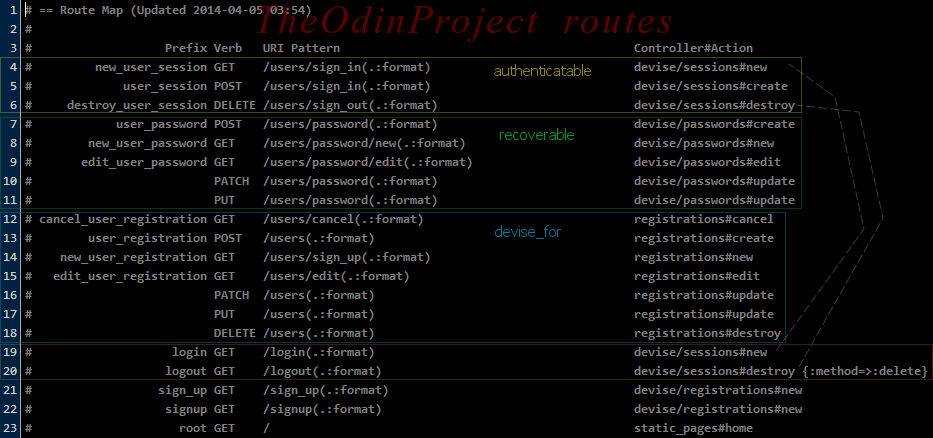
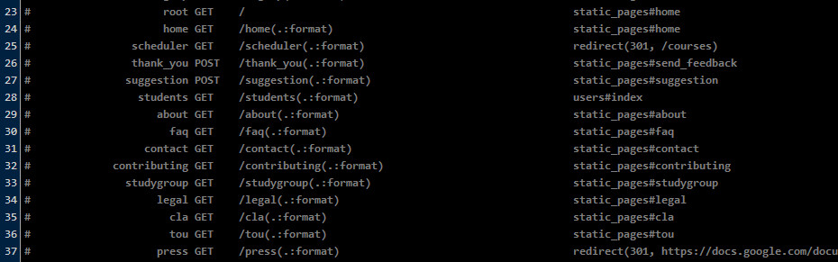

## Rails Study Group Week 5 Transcript


- [The Odin Project](http://www.theodinproject.com)

- [Study Group page on Odin](http://www.theodinproject.com/studygroup)

- [Week 5 Hangout Video]()

---

Four gives you more, but five is hella live!  **Welcome to Week 5: Routing**

- Last week we did an overview of how a combo of HTTP verbs plus the url map to an action
in our Rails app's controller.  Routing is about the mechanism in Rails that makes that 
happen.


- **The routing system does two things:** 

  It maps requests to controller action methods, and 
  it enables the dynamic generation of URLs for you for use as arguments to methods like 
  link_to and redirect_to.

- I thought the [Routing Intro section on Odin](http://www.theodinproject.com/ruby-on-rails/routing)
 was an easily digestable good read! :-)

- I had a hard time reading and learning the routing information from the RailsGuides!

- Luckily basic routing is pretty... basic!  Though there are a lot of little details that can
go in one ear and out the other because it might be many applications down the line before we need some
of those details. For me, I have to go over the syntax and the details over-and-over *and
use it* for it to sink in.  Until then, this is yet another one of those things where I'll
be looking up and copying and pasting code for a while.   So in this weeks studygroup, we'll go
deeper than your basic tutorial, but we won't cover everything there is to know.


- Also last week we looked at the 
[RailsGuides' Getting Started App's routes file](https://github.com/afshinator/OdinRailsStudyGroup/blob/master/week4-transcript.md#odins-restclient-project).  
That was a nice example of **Nested Resources**.
Let's take quick looksy again.

  First, the ```resoures``` part is telling the router that we want RESTful routes for posts resources; 
  that is, posts_url, edit_post_url, edit_post_path, etc... 

  We also want RESTful routes for comments: post_comments_url, new_post_comment_url, and so on. Notice how
  these helpers start with post.

  The nested resource also tells Rails that whenever we use the comment route helpers, we will provide a
  post to relate it to.  See the argument to the named route method:

  ```link_to "See all comments", post_comment_path(post)```

  So now the router will add the ```/posts/4``` part before the ```/comments``` part.  And now in
  ```comments/index``` we'll have the id of the post in ```params[:post_id]```.

  Note: Nesting resources beyond 1 level deep is allowed, but considered an anti-pattern.

  This [excerpt from The Rails Way](http://www.informit.com/articles/article.aspx?p=1671632&seqNum=7)
  goes into some more detail.


- **Singular and plural RESTful Routes [helper methods]** ; [ref: The Rails Way](http://www.informit.com/store/rails-3-way-9780321601667)

  "Some of the RESTful routes [helpers] are singular; some are plural. The logic is as follows:

  1. **Routes for show, new, edit, and destroy are singular**, because they’re working on a particular resource.

  2. **The rest of the routes are plural**. They deal with collections of related resources.

  The singular RESTful routes [helpers] require an argument, because they need to be able to figure out the 
  id of the member of the collection referenced.

  ```item_url(item)         # show, update, or destroy, depending on HTTP verb```

  You don’t have to call the id method on item. Rails will figure it out (by calling ```to_param``` on the 
  object passed to it)."


- **'resource' vs. 'resources' in the routes file** 

  The example we saw showed two resources:

``` ruby
resources :posts do               # notice 'resources' is plural in both lines
  resoures :comments
end

```  

  What does this do : ```resource :profile``` ?    (Notice its singular)

  It's used when there's only one resource of its type for the whole application; for example: a
  per-user profile.  You get all the resource routes, just like using ```resources``` except for the
  index route which is for collections.   

  So then ```resource```, the arguments to it, and all the named routes generated are in the singular.


---


Now let's get a little more real-worldsy! Let's take a look at routing in the context of the 
oh-so-prevalent [Devise authentication gem](https://github.com/plataformatec/devise).
Then we'll parse the routes file from the Odin project.


### Routing in Devise

- ```devise_for``` -  Generates a load of routes in routes.rb 
based on what modules you have defined in your model;  
[example:](http://rubydoc.info/github/plataformatec/devise/master/ActionDispatch/Routing/Mapper)

Let's say you have a good ol' User model, and in your ```routes.rb``` you have ```devise_for :users```; 
it'll look inside your model and create the needed routes:

``` ruby
# Session routes for Authenticatable (default)
     new_user_session GET    /users/sign_in                    {controller:"devise/sessions", action:"new"}
         user_session POST   /users/sign_in                    {controller:"devise/sessions", action:"create"}
 destroy_user_session DELETE /users/sign_out                   {controller:"devise/sessions", action:"destroy"}

# Password routes for Recoverable, if User model has :recoverable configured
    new_user_password GET    /users/password/new(.:format)     {controller:"devise/passwords", action:"new"}
   edit_user_password GET    /users/password/edit(.:format)    {controller:"devise/passwords", action:"edit"}
        user_password PUT    /users/password(.:format)         {controller:"devise/passwords", action:"update"}
                      POST   /users/password(.:format)         {controller:"devise/passwords", action:"create"}

# Confirmation routes for Confirmable, if User model has :confirmable configured
new_user_confirmation GET    /users/confirmation/new(.:format) {controller:"devise/confirmations", action:"new"}
    user_confirmation GET    /users/confirmation(.:format)     {controller:"devise/confirmations", action:"show"}
                      POST   /users/confirmation(.:format)     {controller:"devise/confirmations", action:"create"}
```


- Now for **[Odin's ```routes.rb```](https://github.com/TheOdinProject/theodinproject/blob/master/config/routes.rb)**

  Going from the top of the file, the ```devise_for``` below is a bit more complicated than above.  In the 
  screenshot below I've highlighted the sections that correspond to the example above so we can see more 
  easily see what the Odin version is doing :

``` ruby
devise_for :users, :controllers => { :registrations => "registrations" }  # lines 12-18 in picture below
  devise_scope :user do
    get '/login' => 'devise/sessions#new'								# line 19 to line 4
    get '/logout' => 'devise/sessions#destroy', :method => :delete 		# line 20 to line 6
    get 'sign_up' => 'devise/registrations#new'							# line 21
    get 'signup' => 'devise/registrations#new'							# line 22
  end
```



- What is this: ```:users, :controllers => { :registrations => "registrations" }``` ?

  It's telling the router to add registration routes for users, mapped to the registration controller.

- How about: ```devise_scope :user do``` ?

  Also know as ```as```, if you have custom routes, its required in order to specify which controller is targeted : 

``` ruby
as :user do                 # notice it is singular
   get "/some/route" => "some_devise_controller"
end

devise_for :users            # notice its now pluralized
```

- Notice ['devise_scope' and 'as'](http://rubydoc.info/github/plataformatec/devise/master/ActionDispatch/Routing/Mapper:devise_scope) 
  use the singular form of the noun where other devise route commands expect the plural form.


---

This next set is easier to decode:

``` ruby
  root :to => 'static_pages#home'					    # line 23 in picture below
  get 'home' => 'static_pages#home'					    # line 24;  /home also goes to root of site
  get 'scheduler' => redirect('/courses')			    # line 25;  notice this generates a 301
  post 'thank_you' => 'static_pages#send_feedback'	
  post 'suggestion' => 'static_pages#suggestion'	
  get 'students' => 'users#index'					    # line 28; users controller
  get 'about' => "static_pages#about"               # line 29-36 : the static_pages controller
  get 'faq' => "static_pages#faq"
  get 'contact' => "static_pages#contact"			# ...
  get 'contributing' => "static_pages#contributing"
  get 'studygroup' => "static_pages#studygroup"
  get 'legal' => "static_pages#legal"
  get 'cla' => "static_pages#cla"
  get 'tou' => "static_pages#tou"
  get 'press' => redirect('https://docs.google.c   	# line 37; redirects (301) to page outside domain

```



---

Then, the good ol', resourceful one call to seven actions: ```resources: cal_events```; 
**notice PUT & PATCH** are both routed to update action...:

``` ruby
#               cal_events GET    /cal_events(.:format)                cal_events#index
#                          POST   /cal_events(.:format)                cal_events#create
#            new_cal_event GET    /cal_events/new(.:format)            cal_events#new
#           edit_cal_event GET    /cal_events/:id/edit(.:format)       cal_events#edit
#                cal_event GET    /cal_events/:id(.:format)            cal_events#show
#                          PATCH  /cal_events/:id(.:format)            cal_events#update
#                          PUT    /cal_events/:id(.:format)            cal_events#update
#                          DELETE /cal_events/:id(.:format)            cal_events#destroy
```

- Not all browsers support PATCH; rails uses POST as the method in good old ```form_for``` in the view,
but keeps track that it was a PATCH.

---

Then,

``` ruby
  resources :users, :only => [:show, :index, :edit, :update] do
    resource :contact, :only => [:new, :create]
  end
```  

  Notice there is a **nested resource**.  This block maps to:

``` ruby
#             user_contact POST   /users/:user_id/contact(.:format)      contacts#create
#         new_user_contact GET    /users/:user_id/contact/new(.:format)  contacts#new

#                    users GET    /users(.:format)                       users#index
#                edit_user GET    /users/:id/edit(.:format)              users#edit
#                     user GET    /users/:id(.:format)                   users#show
#                          PATCH  /users/:id(.:format)                   users#update
```

---


Then, two resources with :only specifications:

``` ruby
  resources :splash_emails, :only => [:create]

  resource :forum, :only => [:show]
```

  Mapping to:

``` ruby
#            splash_emails POST   /splash_emails(.:format)               splash_emails#create
#                    forum GET    /forum(.:format)                       forums#show
```

---


Then, these are for checking off lessons completed, note the the HTTP verbs:

``` ruby
  post 'lesson_completions' => 'lesson_completions#create'
  delete 'lesson_completions/:lesson_id' => 'lesson_completions#destroy', :as => "lesson_completion"
```

  Mapping to:

``` ruby
#       lesson_completions POST   /lesson_completions(.:format)            lesson_completions#create
#       lesson_completion DELETE /lesson_completions/:lesson_id(.:format)  lesson_completions#destroy
```  

---


Then

``` ruby
  get "sitemap" => "sitemap#index", :defaults => { :format => "xml" }
```

  Mapping to:

``` ruby
#                  sitemap GET    /sitemap(.:format)                       sitemap#index {:format=>"xml"}
```  

---

Then, the courses and lessons routes 

``` ruby
  get 'curriculum' => redirect('/courses')
  get 'courses' => 'courses#index'

  # Explicitly redirect deprecated routes (301)                  # Pretty slick, eh?
  get 'courses/:course_name' => redirect('/%{course_name}')
  get 'courses/:course_name/lessons' => redirect('/%{course_name}')
  get 'courses/:course_name/lessons/:lesson_name' => redirect('/%{course_name}/%{lesson_name}')

  # Match all undefined routes as courses and/or lessons
  get ':course_name' => 'lessons#index', :as => "course"         # :as provides course_path helper
  get ':course_name' => 'lessons#index', :as => "lessons"		 # :as provides lessons_path
  get ':course_name/:lesson_name' => 'lessons#show', :as => "lesson"
```

  Mapping to:

``` ruby
#               curriculum GET    /curriculum(.:format)                                redirect(301, /courses)
#                  courses GET    /courses(.:format)                                   courses#index
#                          GET    /courses/:course_name(.:format)                      redirect(301, /%{course_name})
#                          GET    /courses/:course_name/lessons(.:format)              redirect(301, /%{course_name})
#                          GET    /courses/:course_name/lessons/:lesson_name(.:format) redirect(301, /%{course_name}/%{lesson_name})
#                   course GET    /:course_name(.:format)                              lessons#index
#                  lessons GET    /:course_name(.:format)                              lessons#index
#                   lesson GET    /:course_name/:lesson_name(.:format)                 lessons#show

``` 

  In the above, ```:as``` lets you specify a name for your route;  
  so the app now can use course_path, course_url, lessons_path, lessons_url in controllers, helpers and views.


---


### Knick - Knacks

**List of routes** - Did you know you can use ```server/rails/info/routes``` in dev environment?

- It's just like when you go to a bad route & it gives you a listing, except no error message.


**Testing Routes** - Rails offers three built-in assertions

-```assert_generates```

-```assert_recognizes```

-```assert_routing```

- or you can use [RSpec](http://rubydoc.info/gems/rspec-rails/frames)'s 
```routes_to``` matcher, 
[SO example](http://stackoverflow.com/questions/9221953/how-to-test-a-nested-resources-controller-with-rspec): 

``` ruby
it "routes to the 'show' action" do
  { get: "/foos/123/bars/456" }.
    should route_to controller: "bars",      # like assert_recognizes
      action: "show",
      foo_id: "123",
      id: "456"
end
```

- another [RSPEC](https://www.relishapp.com/rspec/rspec-rails/docs/routing-specs) example


### [CodeSchool - Surviving API's with RAILS](https://www.codeschool.com/courses/surviving-apis-with-rails)

New video, (first episode free and full of routing stuff) will teach you plenty about routing, 
testing them, and more...; here is a sampling:

- **Constraints** - Enforces subdomain

```resources :thingies, constraints:{ subdomain: 'api'}                  # http://api.foo.com/thingies```

- **Namespaces** - Mapping a URI pattern with a subdir to a controller in its own subdir

``` ruby
namespace :api do
  resources :thingies, only: :index
end

# maps to 
# Prefix       Verb    URI Pattern                Controller#Action
  api_thingies GET     /api/thingies(.:format)    api/thingies#index {:subdomain=>"api"}

 ```

---

**Path Segmented Expansion** - Just means Arguments in the URI are separated using a slash.

```
/thingies
/thingies/:id
/thingies/:id/majigies
/thingies/:id/majigies/:id
```

Most URI's will not depend on **query string parameters**, 
- So a route like ```thingies?id=1``` will route to ```Thingies#index```, and not ```Thingies#show```

But it's ok to use query string parameters in certain cases:

- **filters** - ```/thingies?food=grain```  ; sent to the index action where filter code is run

- **searches** - ```/thingies?keyword=green```

- **pagination** - ```/thingies?page=3&per_page=30```


---

And while we're here,

**match** in ```routes.rb```

- ```match '/items/:id/purchase', to: 'items#purchase'``` matches *any* HTTP verb

  Fails in Rails 4 cuz it opens it up to **Cross-site Scripting (XSS) attack**; an example:

  ```<a href="http://yourapp.com/items/4/purchase">Click to win!</a>```

- Must specify HTTP method :

  ```post '/items/:id/purchase', to: 'items#purchase'```  or

  ```match '/items/:id/purchse', to: 'items#purchse', via: :post```,  or via: :all if need be


**Nested Resources and [Concerns](http://edgeguides.rubyonrails.org/routing.html#routing-concerns)** - to keep code DRY

``` ruby
resources :messages do
  resouces :comments
  resouces :categories
  resouces :tags
end

resources :posts do
  # sames sub resources as above
end

resources :items do
  # same sub resources as above again
end

# Use concerns to turn above into below, which read better:

concern :sociable do
  resources :comments
  resources :categories
  resources :tags
end

resources :messages, concerns: :sociable
resources :posts, concerns: :sociable
resources :items, concerns: :sociable
```

- could also pass options into concern blocks (to limit actions)

- You can even wrap your 3 resources lines with the concerns into its own object, 
and **put it in its own file**!  


### Testing Your routes & controllers

- We'll encounter a bunch as we go through Hartl

- Again, take a look at CodeSchool videos because they cover a range of good stuff, and many start off free.


### For Next Week:

- Controllers

  [RailsGuides on Controllers](http://edgeguides.rubyonrails.org/action_controller_overview.html) -
  sections 1 - 4.5.3 and 5.2

  [Mass-Assignment & Strong parameters](http://www.sitepoint.com/rails-4-quick-look-strong-parameters/)

- Hartl Chpt 5

  Might as well finish it off sooner rather than later.  Odin curriculum doesn't require it until
  the [next project](http://www.theodinproject.com/ruby-on-rails/basic-routes-views-and-controllers).


